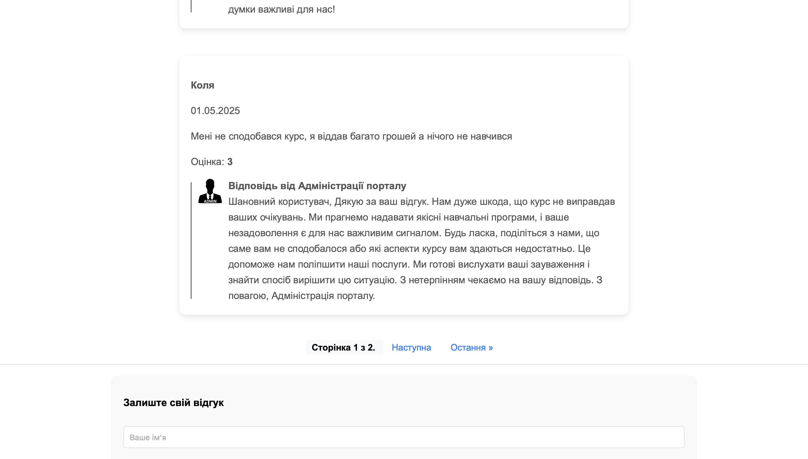
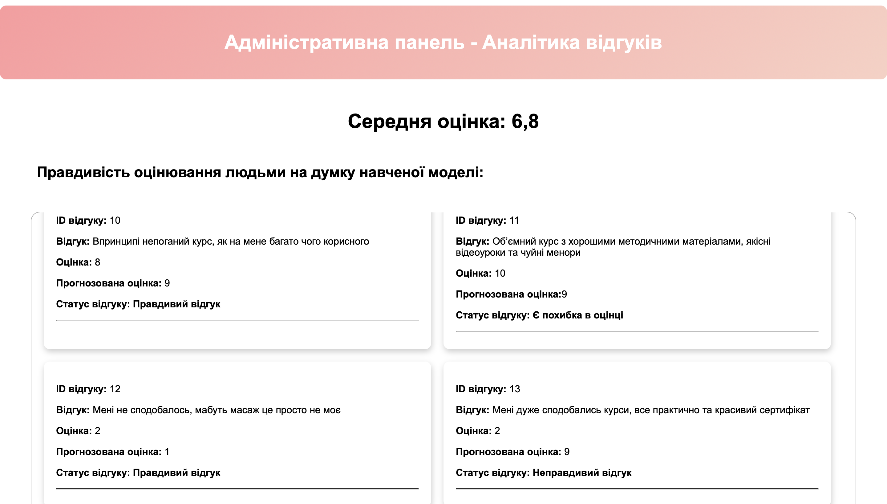
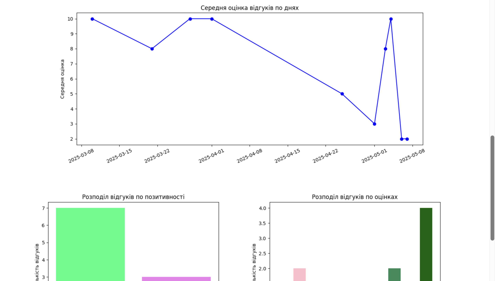

# ReviewAI

## Опис проєкту

**ReviewAI** — це вебплатформа зі вбудованою системою аналізу відгуків на основі штучного інтелекту. Метою є автоматизована обробка користувацьких відгуків для покращення взаємодії з клієнтами та контролю якості сервісу.

### Основні функції:
- Збір відгуків через зручний вебінтерфейс
- Автоматичний аналіз тону повідомлень (позитивний / нейтральний / негативний)
- Виявлення потенційно некоректних або спам-відгуків
- Узагальнення та генерація короткого резюме з великої кількості повідомлень
- Панель адміністратора для перегляду аналітики

## Технології

- Python (Django)
- scikit-learn
- pandas
- matplotlib
- SQLite / PostgreSQL
- HTML5 + CSS3
- AI / NLP моделі

## Скріншоти

## Автор

**Роман Раківський**
